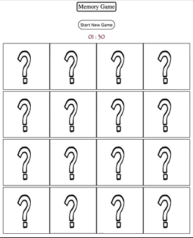

# React memory game

Simple Memory Game with ReactJs, made just for fun.

Check live(wait some sec for page to load): https://react-memory-game-0.herokuapp.com/

## Installing

1) npm install or yarn install
2) npm start or yarn start

## Features

- Timer
- Cards are placed on random positions every time game starts
- use of shouldComponentUpdate to optimize re-renders

### License

This project is licensed under the MIT License - see the [LICENSE.md](LICENSE.md) file for details
